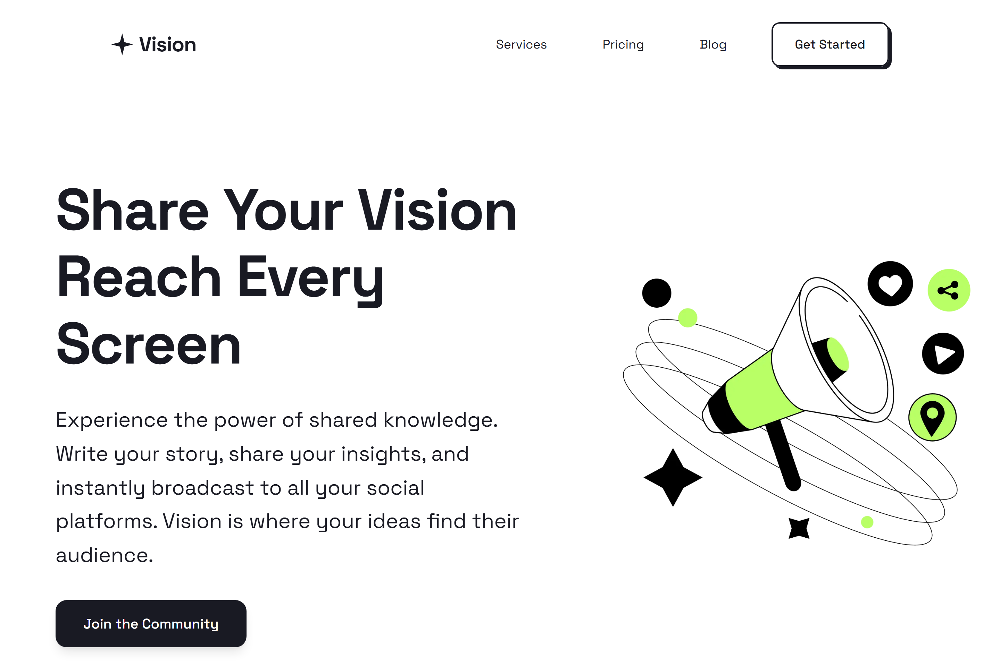
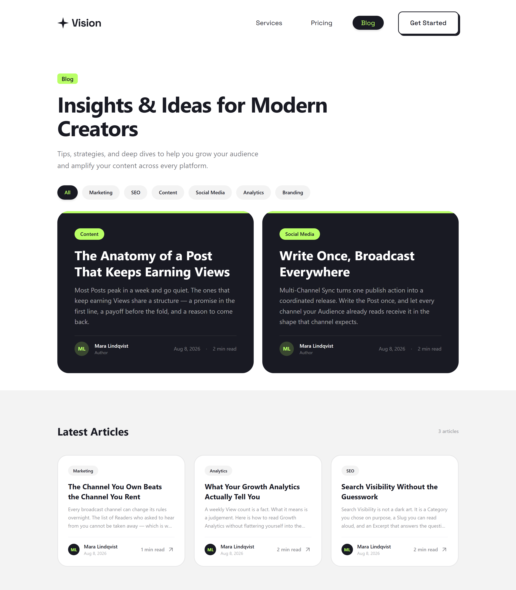
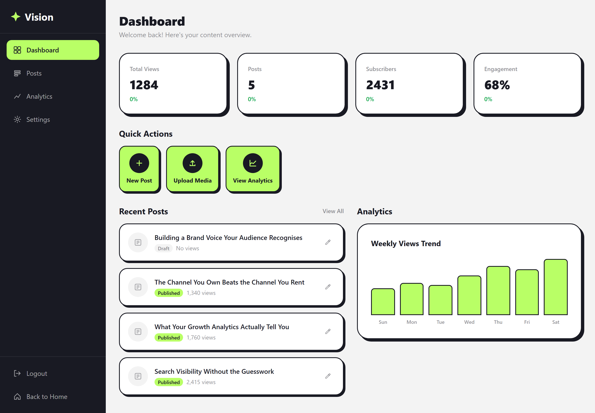
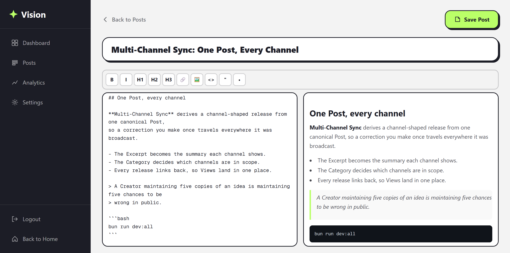

<div align="center">

# Vision

**Refracting ideas into digital reality.**

A publishing platform for content creators: write a Post once, broadcast it to
every social channel, and grow an Audience with built-in discovery and analytics.
This repository holds the marketing site, the blog, and the Smart Creator Hub.

[](https://nextjs.org/)
[](https://www.typescriptlang.org/)

</div>

<p align="center">
  
  <br><sub><b>Landing</b> — the marketing site a Reader arrives on.</sub>
</p>

<p align="center">
  
  <br><sub><b>Blog</b> — Published Posts by Category, with a Featured Post up top.</sub>
</p>

<p align="center">
  
  <br><sub><b>Smart Creator Hub</b> — Views, Posts, and the weekly View trend for a Creator.</sub>
</p>

<p align="center">
  
  <br><sub><b>Editor</b> — split-pane Markdown with live preview; Drafts stay invisible to Readers until Published.</sub>
</p>

## What Vision does

- **Posts and Drafts** — write in Markdown, publish when it is ready, and nothing
  reaches a Reader before you say so
- **Smart Creator Hub** — one dashboard for every Post you own, with search,
  Category and status filters
- **Multi-Channel Sync** — one publish action, a coordinated release everywhere
  your Audience already reads
- **Growth Analytics** — Views per Post and a weekly trend, so a decision rests
  on a number rather than a feeling
- **Search Visibility** — readable Slugs, honest Excerpts, and SEO metadata
  generated from the Post itself
- **Plans** — tiered capabilities with a monthly or yearly billing period

## Quick start

Requires [Bun](https://bun.sh) 1.x and MongoDB 6+ on `localhost:27017`.

```bash
git clone https://github.com/Jiranon-K/vision.git
cd vision
bun install && (cd server && bun install)
```

```bash
cp .env.example .env.local
cp server/.env.example server/.env
```

```bash
bun run dev:all
```

The frontend comes up on `http://localhost:3000` and the API on `http://localhost:3001`.
Full variable reference in [docs/configuration.md](docs/configuration.md).

## Verify

```bash
bun run verify:fast
```

Typechecks, lint and unit tests. `bun run verify:full` adds the production build
and the Playwright suite.

## Documentation

- [Architecture](docs/architecture.md) — tech stack, repository layout, how the pieces relate
- [Configuration](docs/configuration.md) — prerequisites, environment variables, scripts
- [API reference](docs/api.md) — every route on the Express API
- [Deployment](docs/deployment.md) — Docker and manual
- [Design system](docs/design-system.md) — tokens, components, states
- [Domain language](CONTEXT.md) — the vocabulary this codebase is written in
- [Decision records](docs/adr/) · [All documentation](docs/README.md)

## Contributing

Branching, commit conventions, verification and the pre-commit hook are in
[CONTRIBUTING.md](CONTRIBUTING.md).
